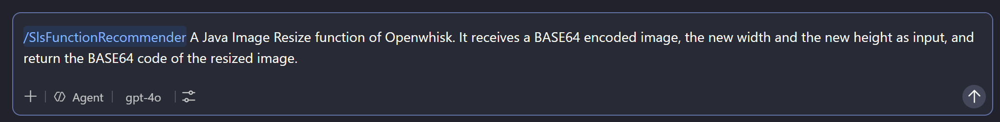

# VS Code Copilot Code Recommendation Guide

This guide describes how to use **VS Code Copilot** for code recommendation, specifically for matching natural language requests to optimal serverless functions from a given dataset.

## Prerequisites

- VS Code installed
- GitHub Copilot extension enabled
- A dataset directory containing serverless function source code files


## Step 1: Configure the System Prompt as a Prompt File

1. Create a directory named `.github/prompt` in your workspace:
   ```bash
   mkdir -p .github/prompt
   ```

2. Create a prompt file (e.g., `serverless-recommender.prompt.md`) inside `.github/prompt/` with the following content:

   ```markdown
   ---
   description: "Recommend top 10 serverless functions from all of the functions in dataset matching user natural language request"
   name: "SlsFunctionRecommender"
   argument-hint: "Describe the serverless function you need"
   ---

   ## Role and Objective

   You are an expert agent in serverless computing and software engineering. Your objective is to perform end-to-end code recommendation by matching a user's natural language request to the most optimal serverless functions from a given dataset.

   ## Context:

   The dataset (located ./dataset) is structured as a directory containing multiple serverless implementations. Each function is isolated within a subdirectory named with its unique identifier (e.g., "function1", "function2"), containing its source code files (e.g., lambda_function.py, main.py).

   ## Task:

   Comprehensively read and analyze the provided dataset contents. You should read and evaluate all of the subdirectories and their contents, rather than just a subset. Evaluate each function's semantics, programming language, and invoked cloud services against the user request. Determine the top 10 best-matching functions.

   ## Output Constraints:

   To optimize metric evaluation and eliminate unnecessary token consumption, you MUST output STRICTLY a comma-separated list of the top 10 function IDs in descending order of relevance (e.g., function42, function7, function102). Do NOT output any explanations, markdown code blocks, prefixes, or concluding remarks.
   ```

   > **Note:** Customize the prompt file according to your specific use case. The `name` field defines the command trigger (e.g., `/SlsFunctionRecommender`), and the `argument-hint` guides users on what to provide.

## Step 2: Open the Function Source Code Directory as Workspace

1. Open VS Code.
2. Navigate to the directory containing **only the function source code files** (e.g., the `dataset` directory).
3. Open this directory as your workspace:
   - Click **File** → **Open Folder...**
   - Select the directory (e.g., `dataset`)
   - Click **Select Folder**

   > **Important:** The workspace should contain **only** the function source code files, without any additional configuration files or unrelated content. This ensures Copilot focuses solely on the function implementations.

## Step 3: Submit Your Natural Language Query

1. In VS Code, open the **Copilot Chat** panel (use the Copilot icon in the sidebar or press `Ctrl+Shift+P` and type "Copilot Chat: Open Chat").

2. Type the custom command followed by your natural language description. For example:

   

   - `/SlsFunctionRecommender` triggers the custom prompt file you configured.
   - The text after the command is your **user query** describing the function you need.

3. Press **Enter** to submit the query.

## Step 4: Review the Results

Copilot will analyze all functions in the workspace and return the **top 10 best-matching function IDs** in a comma-separated list, ordered by relevance.

Example output:
```
function42, function7, function102, function15, function88, function3, function56, function21, function74, function91
```

